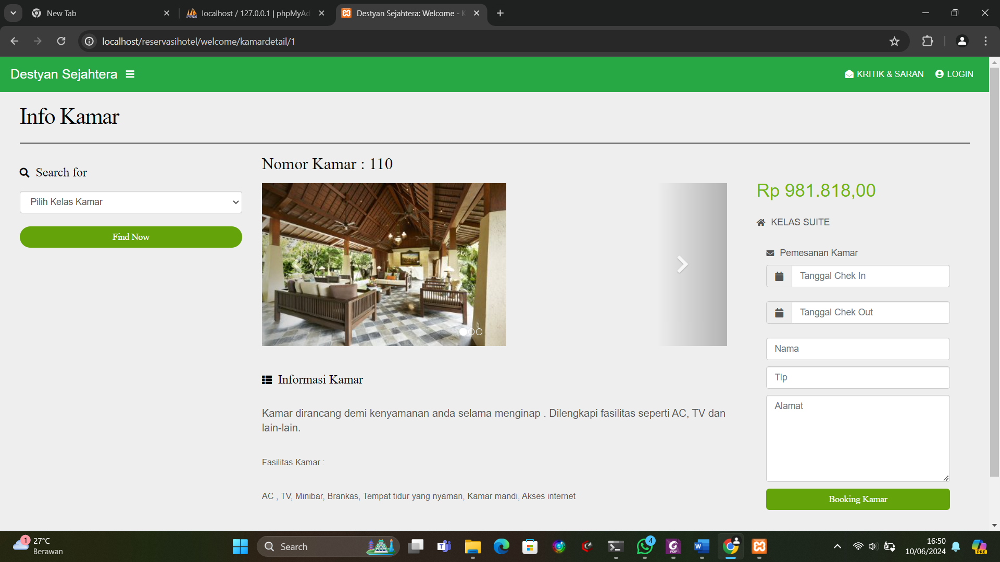

# Boundary Value Analysis (BVA) – Test Cases

| TC   | Field     | Input                                                    | Expected                                | Keterangan                   |
|------|-----------|----------------------------------------------------------|-----------------------------------------|-------------------------------|
| TC1  | Check-in  | 25 Mei 2025 & 25 Mei 2025                                | Valid (boleh sama)                      | Lower bound                  |
| TC2  | Check-in  | 24 & 25 Mei 2025                                         | Valid                                   | Nominal                      |
| TC3  | Check-in  | 26 & 25 Mei 2025                                         | Invalid (tidak bisa booking)            | Just-above boundary          |
| TC4  | Check-in  | minimal allowed & minimal (contoh: 10 Jun 2024 & 10 Jun) | Valid                                   | Lower boundary sistem        |
| TC5  | Check-in  | satu hari sebelum minimal (9 Jun 2024 & 10 Jun 2024)     | Invalid                                 | Just-below boundary          |
| TC6  | Telepon   | `0812345678` (10 digit)                                  | Valid                                   | Lower bound                  |
| TC7 | Telepon   | `081234567890123` (15 digit)                             | Valid                                   | Upper bound                  |
| TC8 | Telepon   | `081234567` (9 digit)                                    | Invalid                                 | Just-below boundary          |
| TC9 | Telepon   | `0812345678901234` (16 digit)                            | Invalid                                 | Just-above boundary          |
| TC10 | Telepon   | `abcdef`                                                 | Invalid / tidak muncul (filtered)       | Karakter non-angka           |

**Catatan:**  
- Sesuaikan `minimal`/`maksimal` tanggal dengan kebijakan sistem.  
- Tandai hasil eksekusi (✅/❌) setelah pengujian manual otomatis.  
