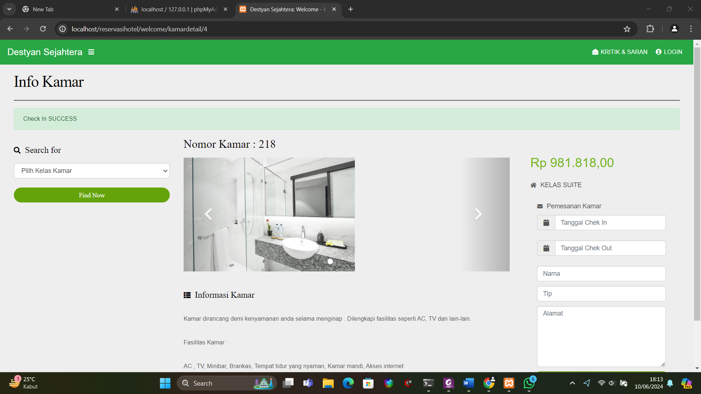

# Decision Table Testing – Booking Form

## Kondisi (Conditions)
1. **C1: Semua Field Terisi** (Nama, Tlp, Alamat, Check-in, Check-out)  
2. **C2: Check-in ≤ Check-out**  
3. **C3: Telepon Hanya Angka**  

## Aksi (Actions)
- **A1: Tombol Booking Aktif**  
- **A2: Data Dikirim ke Admin**  

---

## Tabel Keputusan

| No. | C1  | C2  | C3  | A1 (Enable) | A2 (Submit) | Keterangan                                    |
|-----|-----|-----|-----|-------------|-------------|-----------------------------------------------|
| R1  | Y   | Y   | Y   | Ya          | Ya          | Semua valid → kirim data                       |
| R2  | N   | Y   | Y   | Tidak       | Tidak       | Ada field kosong → button disabled             |
| R3  | Y   | N   | Y   | Tidak       | Tidak       | Check-in > Check-out → button disabled         |
| R4  | Y   | Y   | N   | Tidak       | Tidak       | Telepon non-angka → button disabled            |
| R5  | N   | N   | Y   | Tidak       | Tidak       | Field kosong + tanggal salah → disabled        |
| R6  | Y   | N   | N   | Tidak       | Tidak       | Tanggal salah + telepon non-angka → disabled   |
| R7  | N   | Y   | N   | Tidak       | Tidak       | Field kosong + telepon non-angka → disabled    |
| R8  | N   | N   | N   | Tidak       | Tidak       | Semua salah/keluar → disabled                  |

---

## Test Case Turunan dari Decision Table

| TC  | C1  | C2   | C3   | A1  | A2  | Input Contoh                                                                 | Expected Output            |
|-----|-----|------|------|-----|-----|------------------------------------------------------------------------------|----------------------------|
| TC1 | Y   | Y    | Y    | Ya  | Ya  | Semua field terisi, Check-in=25/05/2025 ≤ Check-out=25/05/2025, Tlp=0812345678 | Tombol aktif, data terkirim |
| TC2 | N   | Y    | Y    | Tidak | Tidak | Nama dikosongkan, tanggal valid, tlp valid                                   | Tombol disabled            |
| TC3 | Y   | N    | Y    | Tidak | Tidak | Semua field terisi, Check-in=26/05/2025 > Check-out=25/05/2025, tlp valid      | Tombol disabled            |
| TC4 | Y   | Y    | N    | Tidak | Tidak | Semua field terisi, tanggal valid, Tlp=`abcde`                                | Tombol disabled            |
| TC5 | N   | N    | Y    | Tidak | Tidak | Misal: Nama kosong, Check-in=26 > Check-out=25, tlp valid                     | Tombol disabled            |
| TC6 | Y   | N    | N    | Tidak | Tidak | Semua field terisi, Check-in>Check-out, tlp non-angka                          | Tombol disabled            |
| TC7 | N   | Y    | N    | Tidak | Tidak | Nama kosong, tanggal valid, tlp non-angka                                     | Tombol disabled            |
| TC8 | N   | N    | N    | Tidak | Tidak | Nama kosong, Check-in>Check-out, tlp non-angka                                | Tombol disabled            |

**Catatan:**
- **C1 (Field lengkap)** = semua input (Nama, Tlp, Alamat, tanggal) tidak boleh kosong.  
- **C2 (Tanggal)** = check-in tidak boleh melewati check-out.  
- **C3 (Telepon)** = hanya mengizinkan digit (client-side filter).

