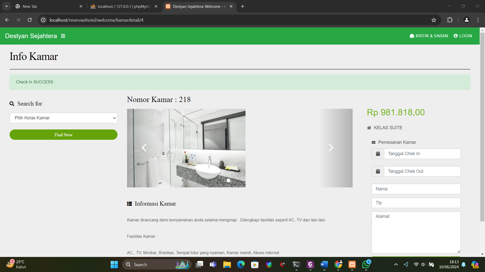

# Equivalence Partitioning – Booking Form

## Partisi dan Test Case

| TC   | Field       | Partisi            | Input Contoh                   | Expected Output                                       | Keterangan                             |
|------|-------------|--------------------|--------------------------------|-------------------------------------------------------|-----------------------------------------|
| TC1   | Nama        | Valid              | “Ridwan Beben”                 | Tombol aktif, data terkirim ke admin                  | Partisi valid string                    |
| TC2   | Nama        | Invalid (kosong)   | “” (empty)                     | Tombol disabled                                       | Harus diisi                              |
| TC3   | Telepon     | Valid              | “081234567890”                 | Tombol aktif, data terkirim                            | Digit, panjang normal (10–15)           |
| TC4   | Telepon     | Invalid (karakter) | “08123ABC”                     | Tombol disabled                                       | Non-digit terfilter otomatis            |
| TC5   | Telepon     | Invalid (too short)| “0812345”                      | Tombol disabled                                       | < 10 digit                              |
| TC6   | Telepon     | Invalid (too long) | “0812345678901234567”          | Tombol disabled                                       | > 15 digit                              |
| TC7   | Check-in    | Valid              | 20 Jun 2024 ≤ tanggal ≤ batas  | Tombol aktif jika C2, C3 juga valid                    | Partisi tanggal masuk akal             |
| TC8   | Check-in    | Invalid (past)     | Tanggal < hari ini             | Tombol disabled                                       | Tidak boleh di masa lalu                |
| TC9   | Check-in    | Invalid (format)   | “2024/06/20”                   | Tombol disabled / date-picker reject                   | Format dd MMM yyyy                      |
| TC10  | Check-out   | Valid              | Check-out ≥ Check-in           | Tombol aktif jika C1, C3 juga valid                    | Partisi tanggal keluar akal            |
| TC11  | Check-out   | Invalid (< C-in)   | Check-out < Check-in           | Tombol disabled                                       | Check-out wajib ≥ Check-in              |
| TC12  | Alamat      | Valid              | “Jl. Merdeka No. 1”            | Tombol aktif, data terkirim                            | Partisi string                          |
| TC13  | Alamat      | Invalid (kosong)   | “”                             | Tombol disabled                                       | Harus diisi                              |

•	Karena sistem tidak menampilkan error, maka validasi dideteksi melalui perilaku tombol Booking yang tidak aktif.  
•	Tidak ada pesan gagal / sukses — hanya perilaku sistem dan flow data ke admin.
