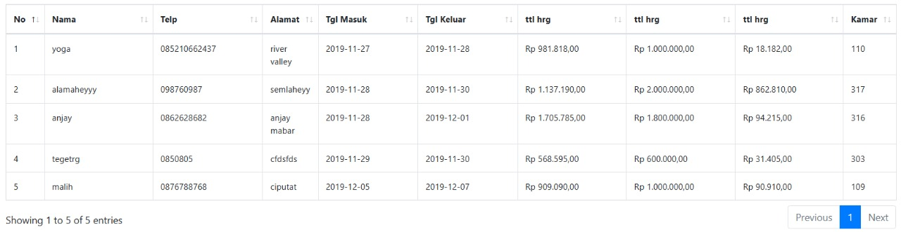

Test dijalankan berdasarkan fitur data pesanan yang bisa di akses dengan login admin  
- Variabel Jenis kamar  
- Variabel Harga Kamar  
- Variabel lama menginap berdasarkan tanggal masuk dan keluar

  


| Test Case | Jenis Kamar | Harga Kamar              | Lama Menginap |# Orthogonal Array Testing – Booking Form

## 1. Faktor & Level

| Faktor            | Level 1          | Level 2           | Level 3         |
|-------------------|------------------|-------------------|-----------------|
| **Jenis Kamar**   | Suite            | Deluxe            | Deluxe RO       |
| **Harga Kamar**   | Mahal (≥1.000.000) | Sedang (500–999K) | Murah (<500K)   |
| **Durasi Menginap** | 1 hari           | 2 hari            | 3 hari          |

## 2. Orthogonal Array L9 (3³)

| Row | Jenis Kamar | Harga Kamar          | Durasi  |
|-----|-------------|----------------------|---------|
| 1   | Suite       | Mahal                | 1 hari  |
| 2   | Suite       | Sedang               | 2 hari  |
| 3   | Suite       | Murah                | 3 hari  |
| 4   | Deluxe      | Mahal                | 2 hari  |
| 5   | Deluxe      | Sedang               | 3 hari  |
| 6   | Deluxe      | Murah                | 1 hari  |
| 7   | Deluxe RO   | Mahal                | 3 hari  |
| 8   | Deluxe RO   | Sedang               | 1 hari  |
| 9   | Deluxe RO   | Murah                | 2 hari  |

> Tabel di atas menjamin setiap level dari satu faktor dipasangkan secara seimbang dengan setiap level faktor lain.

## 3. Test Case Turunan

| TC   | Jenis Kamar | Harga      | Durasi  | Input Contoh                                                       | Expected                                                                 |
|------|-------------|------------|---------|--------------------------------------------------------------------|--------------------------------------------------------------------------|
| TC1  | Suite       | Mahal      | 1 hari  | Pilih “Suite”, harga 1.2M, durasi 1 hari                           | Tombol booking aktif; total = 1.2M × 1                                  |
| TC2  | Suite       | Sedang     | 2 hari  | Pilih “Suite”, harga 750K, durasi 2 hari                           | Tombol aktif; total = 750K × 2                                          |
| TC3  | Suite       | Murah      | 3 hari  | Pilih “Suite”, harga 400K, durasi 3 hari                           | Tombol aktif; total = 400K × 3                                          |
| TC4  | Deluxe      | Mahal      | 2 hari  | Pilih “Deluxe”, harga 1.1M, durasi 2 hari                          | Tombol aktif; total = 1.1M × 2                                          |
| TC5  | Deluxe      | Sedang     | 3 hari  | Pilih “Deluxe”, harga 800K, durasi 3 hari                          | Tombol aktif; total = 800K × 3                                          |
| TC6  | Deluxe      | Murah      | 1 hari  | Pilih “Deluxe”, harga 450K, durasi 1 hari                          | Tombol aktif; total = 450K × 1                                          |
| TC7  | Deluxe RO   | Mahal      | 3 hari  | Pilih “Deluxe Room Only”, harga 1.3M, durasi 3 hari                | Tombol aktif; total = 1.3M × 3                                          |
| TC8  | Deluxe RO   | Sedang     | 1 hari  | Pilih “Deluxe Room Only”, harga 600K, durasi 1 hari                | Tombol aktif; total = 600K × 1                                          |
| TC9  | Deluxe RO   | Murah      | 2 hari  | Pilih “Deluxe Room Only”, harga 300K, durasi 2 hari                | Tombol aktif; total = 300K × 2                                          |

---

## Cara Update di GitHub

1. **Buka** folder `Grey Box Testing/Orthogonal Array Testing/`.  
2. **Edit** `hasil uji.md` (atau buat `orthogonal-array-test-cases.md`) dengan konten di atas.  
3. **Commit & Push**:
   ```bash
   git checkout -b feature/update-orthogonal-array
   git add Grey\ Box\ Testing/Orthogonal\ Array\ Testing/hasil\ uji.md
   git commit -m "Complete Orthogonal Array Testing with L9 design"
   git push origin feature/update-orthogonal-array

| --------- | ----------- | ------------------------ | ------------- |
| TC1       | Mewah       | Rp 981.818,00            | 1 hari        |
| TC2       | Standar     | Rp 1.137.190,00          | 2 hari        |
| TC3       | Standar     | Rp 1.705.785,00          | 3 hari        |
| TC4       | Sedang      | Rp 568.595,00            | 1 hari        |
| TC5       | Standar     | Rp 909.090,00            | 2 hari        |
