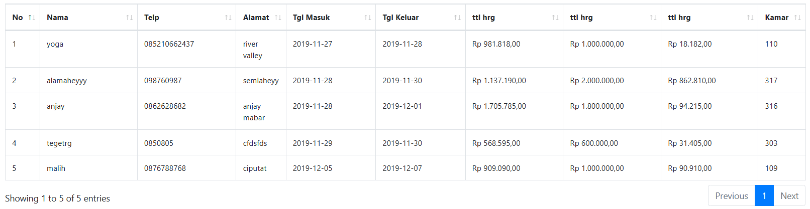

Test dijalankan berdasarkan fitur data pesanan yang bisa di akses dengan login admin  
- Variabel Jenis kamar  
- Variabel Harga Kamar  
- Variabel lama menginap berdasarkan tanggal masuk dan keluar

  

| Test Case | Jenis Kamar | Harga Kamar              | Lama Menginap |
| --------- | ----------- | ------------------------ | ------------- |
| TC1       | Standar     | < Rp 1.000.000           | 1 hari        |
| TC2       | Standar     | Rp 1.000.000 – 2.000.000 | 2–3 hari      |
| TC3       | Standar     | > Rp 2.000.000           | >3 hari       |
| TC4       | Sedang      | < Rp 1.000.000           | 2–3 hari      |
| TC5       | Sedang      | Rp 1.000.000 – 2.000.000 | >3 hari       |
| TC6       | Sedang      | > Rp 2.000.000           | 1 hari        |
| TC7       | Mewah       | < Rp 1.000.000           | >3 hari       |
| TC8       | Mewah       | Rp 1.000.000 – 2.000.000 | 1 hari        |
| TC9       | Mewah       | > Rp 2.000.000           | 2–3 hari      |

