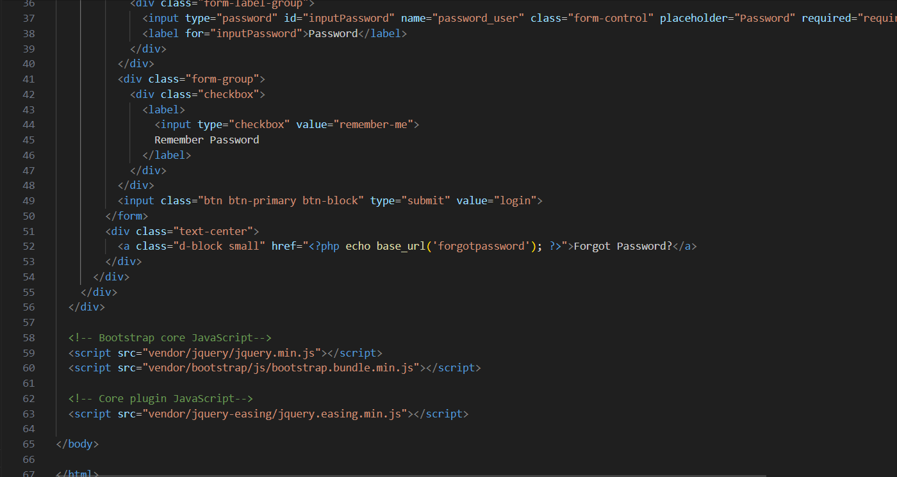

| Baris Kode | Potongan Kode                                                                                         | Penjelasan Walkthrough                                                                                   |
|------------|--------------------------------------------------------------------------------------------------------|-----------------------------------------------------------------------------------------------------------|
| 1–2        | <code>&lt;!DOCTYPE html&gt; &lt;html lang="en"&gt;</code>                                              | Mendefinisikan tipe dokumen dan bahasa yang digunakan pada halaman adalah bahasa Inggris.                |
| 9          | <code>&lt;title&gt;SB Admin - Login&lt;/title&gt;</code>                                               | Judul halaman ditampilkan di tab browser.                                                                |
| 20–21      | <code>&lt;body class="bg-dark"&gt;</code>                                                              | Memulai bagian body halaman, dengan latar belakang warna gelap.                                          |
| 23–25      | <code>&lt;div class="card card-login mx-auto mt-5"&gt;...&lt;/div&gt;</code>                           | Membuat elemen kartu (card) untuk form login yang diposisikan di tengah (margin x auto).                 |
| 27         | <code>&lt;form action="&lt;?php echo base_url('login/aksi_login'); ?&gt;" method="post"&gt;</code>     | Form akan mengirim data ke controller login/aksi_login menggunakan metode POST.                          |
| 29–32      | <code>&lt;input type="text" id="inputUsername" name="username_user"...&gt;</code>                      | Input field untuk username. Nilainya akan dikirim dengan nama username_user.                             |
| 33–36      | <code>&lt;input type="password" id="inputPassword" name="password_user"...&gt;</code>                  | Input field untuk password. Nilainya akan dikirim dengan nama password_user.                             |
| 38–42      | Checkbox "Remember Password"                                                                            | Memberi opsi kepada user untuk mengingat password. Hanya visual, belum ada proses logic di backend.      |
| 43         | <code>&lt;input class="btn btn-primary btn-block" type="submit" value="login"&gt;</code>               | Tombol untuk mengirim form login. Jika ditekan, data username dan password dikirim ke server.            |
| 46         | <code>&lt;a class="d-block small" href="..."&gt;Forgot Password?&lt;/a&gt;</code>                      | Link untuk menuju ke halaman lupa password.                                                              |
| 49–51      | <code>&lt;script src="vendor/jquery/jquery.min.js"&gt;</code> dan lainnya                              | JavaScript tambahan dari jQuery dan Bootstrap untuk interaksi halaman (misal: animasi, validasi UI).     |

