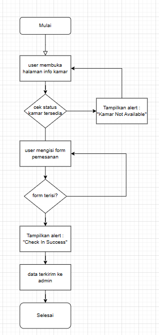

Flowchart :  
  

Komponen                             | Definisi                                               | Penggunaan                             | Deskripsi                                                                |
| ------------------------------------ | ------------------------------------------------------ | -------------------------------------- | ------------------------------------------------------------------------ |
| Buka Halaman Info Kamar              | Menampilkan informasi dan form pemesanan kamar         | Langkah awal sebelum memesan kamar     | Pengguna membuka halaman info kamar untuk melihat detail dan memesan.    |
| Cek Status Kamar Tersedia            | Mengecek apakah kamar tersedia                         | Validasi awal ketersediaan kamar       | Sistem mengecek status kamar apakah masih bisa dipesan.                  |
| Tampilkan Alert Kamar Tidak Tersedia | Pesan peringatan jika kamar tidak tersedia             | Ditampilkan jika status\_kamar != 0    | Sistem menampilkan alert jika kamar tidak tersedia.                      |
| Isi Form Pemesanan                   | Input data dari user (check-in, check-out, nama, dll.) | Input wajib dari pengguna              | Pengguna mengisi semua kolom form pemesanan.                             |
| Validasi Form Terisi                 | Mengecek apakah semua field terisi                     | Validasi input                         | Sistem tidak melanjutkan jika ada field kosong.                          |
| Alert Check In Success               | Memberikan konfirmasi jika data berhasil disimpan      | Ditampilkan setelah pemesanan berhasil | Jika validasi berhasil, sistem menampilkan alert bahwa pemesanan sukses. |
| Data Dikirim ke Admin                | Proses penyimpanan ke database untuk konfirmasi admin  | Setelah alert sukses                   | Data dikirim ke admin untuk dikonfirmasi di backend.                     |

| Kode                                                                                                          | Penjelasan                                                                            |
| ------------------------------------------------------------------------------------------------------------- | ------------------------------------------------------------------------------------- |
| `php <?php $this->load->view("tamu/head.php") ?> <?php $this->load->view("tamu/navbar.php") ?>`         | Memuat bagian head dan navbar. Digunakan saat halaman info kamar dibuka pertama kali. |
| `php <?php if(validation_errors()) { ?> ... <?php echo validation_errors(); ?> <?php } ?>`        | Menampilkan pesan error jika ada input form yang kosong atau tidak sesuai.            |
| `php <?php if($this->session->flashdata('berhasil')) { ?> echo "Check In SUCCESS"; <?php } ?>`       | Flashdata untuk menampilkan pesan sukses setelah form berhasil dikirim.               |
| `php foreach ($kamar->result_array() as $value) {  $status_kamar = $value['status_kamar']; ... }` | Mengambil data kamar dari database dan mengecek status apakah tersedia atau tidak.    |
| `php if ($status_kamar == 0) { echo form_open('welcome/reservasi/'); `                               | Menampilkan form pemesanan jika status kamar = 0 (tersedia).                          |
| `html <input type="text" name="tgl_reservasi_masuk" placeholder="Tanggal Check In">`                       | Input tanggal check-in. Harus diisi agar form bisa dikirim.                           |
| `html <input type="text" name="tgl_reservasi_keluar" placeholder="Tanggal Check Out">`                     | Input tanggal check-out. Harus lebih dari atau sama dengan check-in.                  |
| `html <input type="text" name="nama_reservasi" placeholder="Nama">`                                        | Input nama pemesan. Wajib diisi.                                                      |
| `html <input type="number" name="tlp_reservasi" placeholder="Tlp">`                                        | Input nomor telepon. Hanya menerima angka.                                            |
| `html <textarea name="alamat_reservasi" placeholder="Alamat"></textarea>`                                  | Input alamat lengkap pemesan.                                                         |
| `html <button type="submit">Booking Kamar</button>`                                                        | Tombol untuk submit form. Hanya aktif jika seluruh field terisi.                      |
| `php } else { ?> 
Kamar Not Available
 <?php } ?>`               | Jika kamar tidak tersedia, tampilkan alert peringatan.                                |
| `php <?php echo form_close(); ?>`                                                                          | Menutup tag form setelah seluruh field input.                                         |
| `php <?php $this->load->view("tamu/footer.php") ?> <?php $this->load->view("tamu/js.php") ?>`           | Menampilkan bagian footer dan file JavaScript penutup halaman.                        |
